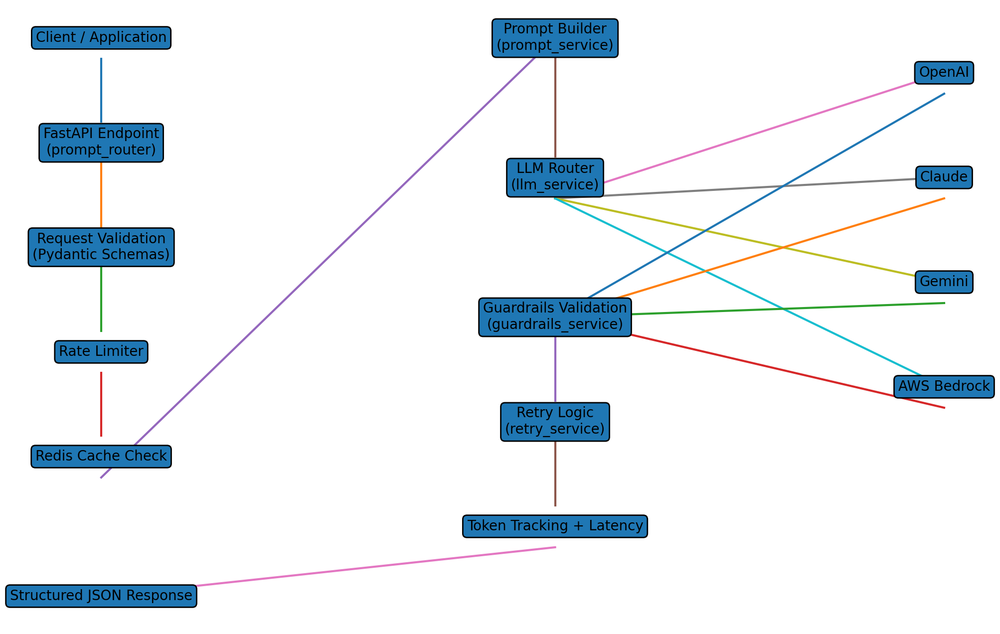

# 🤖 Prompt Guardrails Engine – Multi‑LLM-AI Service

A production‑style FastAPI microservice that sends prompts to LLMs and guarantees **validated structured JSON outputs** using guardrails, retries, caching, and provider switching.

This service supports **OpenAI, Claude, Gemini, and Amazon Bedrock** and can dynamically switch models using configuration without changing code.

---

## 🧩 Problem Statement

Large Language Models often produce:

- inconsistent outputs
- hallucinated responses
- invalid JSON
- unpredictable formats
- high latency or unnecessary token usage

For production systems, this creates problems such as:

- broken downstream pipelines
- unreliable automation
- increased API cost
- lack of observability and monitoring

Applications need **deterministic structured outputs** and a **controlled execution pipeline** before integrating LLMs into production workflows.

---

## 🎯 What This Project Does

This project introduces a **Prompt Guardrails Engine** that:

- Builds deterministic prompts
- Enforces strict JSON schema outputs
- Validates responses using guardrails
- Retries failed responses automatically
- Supports multiple LLM providers
- Tracks token usage and latency
- Adds caching and rate limiting

It converts **unpredictable LLM responses into reliable structured APIs**.

---

## 🧠 Core Principles

> AI responses must be validated before they are trusted.

The system follows four principles:

1. **Prompt Discipline** – deterministic structured prompts
2. **Guardrails First** – validate outputs before returning
3. **Provider Flexibility** – avoid vendor lock‑in
4. **Observability** – track latency, tokens, and errors

<!-- ---

## 📥 Video Explainer

<a href="https://youtu.be/LonMaPdc2R4" target="_blank">
  
</a> -->

---

## 📥 Input Data

The API receives structured requests.

Example request:

```json
{
  "text": "Customer filed a vehicle damage claim worth 2000 dollars"
}
```

---

## 📤 Output

Validated structured JSON.

Example:

```json
{
  "claim_type": "vehicle_damage",
  "risk_score": 0.21,
  "explanation": "Vehicle damage claim detected"
}
```

The response is guaranteed to pass schema validation before being returned.

---

## 🏗 Architecture Flow

```
Client Request
      │
      ▼
FastAPI Endpoint
      │
      ▼
Request Schema Validation
      │
      ▼
Rate Limiter
      │
      ▼
Redis Cache Check
      │
      ▼
Prompt Builder
      │
      ▼
LLM Provider Router
      │
      ▼
Selected Model (OpenAI / Claude / Gemini / Bedrock)
      │
      ▼
Guardrails Validation
      │
      ▼
Retry if Invalid
      │
      ▼
Token Tracking + Latency Measurement
      │
      ▼
Structured JSON Response
```

---

## 🔁 LLM Provider Switching

The system supports multiple providers.

Change only `.env`:

```
LLM_PROVIDER=openai
LLM_PROVIDER=claude
LLM_PROVIDER=gemini
LLM_PROVIDER=bedrock
```

No code changes required.

---

## ⚙️ Tech Stack

| Layer | Technology |
|------|-------------|
Backend API | FastAPI |
Language | Python |
LLM APIs | OpenAI, Claude, Gemini, AWS Bedrock |
Caching | Redis |
Validation | Pydantic |
Rate Limiting | SlowAPI |
Token Counting | tiktoken |
Containerization | Docker |
Testing | Pytest |

---

## 📊 Observability (Future Extensions)

This system can be extended with production monitoring using:

- **AWS CloudWatch**
- **Prometheus / Grafana**
- **OpenTelemetry**
- **Cost monitoring dashboards**

Metrics that can be tracked:

- query latency
- token usage per request
- LLM response time
- error rates
- provider reliability
- endpoint throughput
- API cost alerts

---

## 🔄 Automation Potential

The service can power:

- automated document processing
- insurance claim classification
- customer support AI pipelines
- compliance validation systems
- internal AI agents

It can also run inside **scheduled workflows or microservice orchestration pipelines**.

---

## ⚙️ Requirements & Run

Install dependencies:

```
pip install -r requirements.txt
```

Run the API server:

```
uvicorn app.main:app --reload
```

## 📘 API Documentation

Detailed API reference available here:

[API Documentation](API_DOCUMENTATION.md)

---

## 📩 Contact

| Name              | Details                             |
|-------------------|-------------------------------------|
| 👨‍💻 Developer     | Sachin Arora                       |
| 📧 Email           | sachnaror@gmail.com                |
| 📍 Location        | Noida, India                       |
| 📂 GitHub          | https://github.com/sachnaror       |
| 🌐 Website         | https://about.me/sachin-arora      |
| 📱 Phone           | +91 9560330483                     |

---

## 📩 Application_Structure

```

├── prompt-guardrails-engine/
│   ├── API_DOCUMENTATION.md
│   ├── requirements.txt
│   ├── Dockerfile
│   ├── README.md
│   ├── docker-compose.yml
│   ├── .env.example
│   ├── app/
│   │   └── main.py
│   │   ├── routers/
│   │   │   └── prompt_router.py
│   │   ├── config/
│   │   │   └── settings.py
│   │   ├── utils/
│   │   │   ├── latency_timer.py
│   │   │   └── json_parser.py
│   │   ├── schemas/
│   │   │   ├── request_schema.py
│   │   │   └── response_schema.py
│   │   ├── rate_limit/
│   │   │   └── limiter.py
│   │   ├── prompts/
│   │   │   └── prompt_templates.py
│   │   ├── caching/
│   │   │   └── redis_cache.py
│   │   ├── logging/
│   │   │   └── logger.py
│   │   ├── services/
│   │   │   ├── guardrails_service.py
│   │   │   ├── llm_service.py
│   │   │   ├── prompt_service.py
│   │   │   └── retry_service.py
│   │   ├── llm_clients/
│   │   │   ├── bedrock_client.py
│   │   │   ├── openai_client.py
│   │   │   ├── gemini_client.py
│   │   │   └── claude_client.py
│   │   ├── token_tracking/
│   │   │   └── token_counter.py
│   ├── tests/
│   │   ├── test_guardrails.py
│   │   └── test_prompt_api.py
│   ├── docs/
│   │   └── API.md
│   ├── scripts/
│   │   └── run_server.sh


```

## 🏗 System Architecture




## 🏗  LLM pipeline

```

Client
  ↓
FastAPI Endpoint
  ↓
Request Validation
  ↓
Rate Limiting
  ↓
Redis Cache
  ↓
Prompt Builder
  ↓
LLM Router
  ↓
OpenAI | Claude | Gemini | Bedrock
  ↓
Guardrails Validation
  ↓
Retry Logic
  ↓
Token Tracking + Latency
  ↓
Structured JSON Response

```
